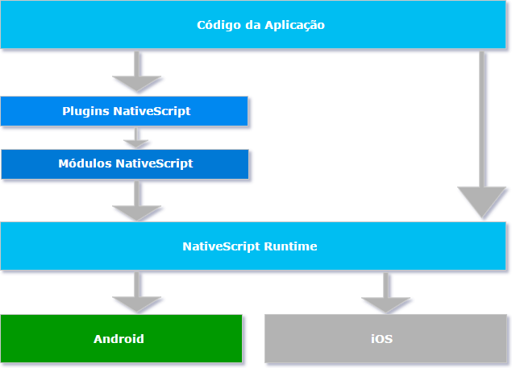

# NativeScript + Angular

Esta aplicação utiliza **NativeScript com TypeScript + Angular**

NativeScript é uma estrutura livre e de código aberto para a construção de aplicações em iOS e Android usando JavaScript e CSS. O NativeScript processa interfaces de utilizador com o mecanismo de renderização da plataforma nativa - sem WebViews - resultando em desempenho nativo e UX.

juntamente com Angular 2, o resultado é uma arquitetura de software que permite criar aplicativos para dispositivos móveis usando a mesma estrutura - e em alguns casos o mesmo código.

### Documentação auxiliar:
[Tutorial + Documentação - TypeScript](https://www.typescriptlang.org/docs/tutorial.html)
[Tutorial - NativeScript com TypeScript + Angular](http://docs.nativescript.org/angular/tutorial/ng-chapter-0).

[Angular 2 - Style Guide](https://angular.io/styleguide)

### Arquitectura de NativeScript
Para permitir o acesso a recursos de plataforma e dispositivos nativos da plataforma de destino (iOS/Android), NativeScript utiliza um design modular - todas as funcionalidades de  dispositivos, plataformas ou interfaces de usuário residem em módulos separados. Os Módulos  expõem os recursos da plataforma nativa do dispositivo de forma consistente.

Um aplicativo NativeScript típico usará o conjunto de módulos que adicionam camada de abstração (_abstraction layer_) entre plataformas sobre as APIs específicas do SO.

Durante a compilação, o runtime do NativeScript traduz código não específico da plataforma para o idioma nativo da plataforma de destino. As ferramentas NativeScript usam os SDKs e ferramentas da plataforma nativa para criar um pacote de aplicativo nativo

O seguinte diagrama de blocos descreve o funcionamento da estrutura de uma app em NativeScript.

